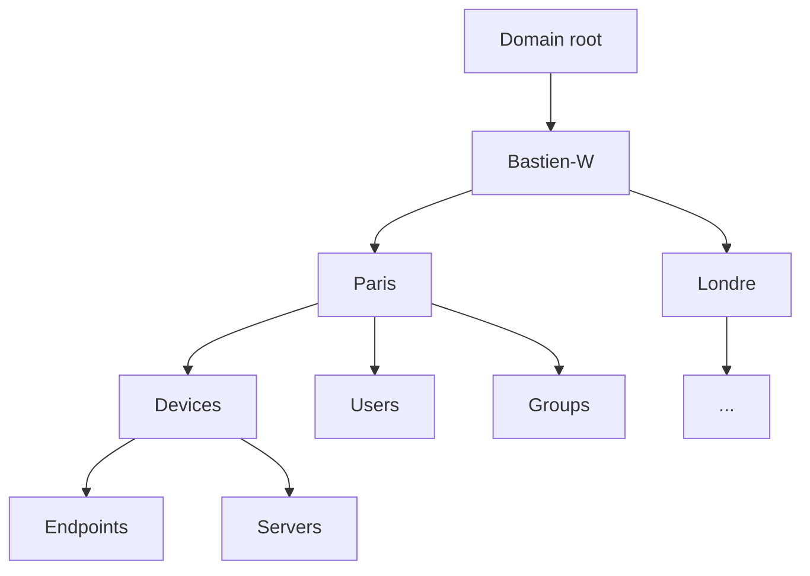

## Introduction
In this document i will centralized all best praticices to setup an configure an Active Directory domain.
This list is not complet and will be updated

## Items
1. Enable reverse lookup for all IP ranges
2. Configure DNS redirector to at least 2 public DNS
3. Local DNS configuration for DC have to use 127.0.0.1 at the bottom of the DNS server list
4. Create the KDS root key to enable the use of gMSA
5. Dispatch FSMO roles on different servers
6. The database folder and the sysvol folder should be on dedicated disk
7. Define naming convention for users, devices, groups
8. Users, Endpoints and Servers should not be in the same OU
   1. Keep in mind that your OU should reflect something real in you organization
   2. Aim something like that :

